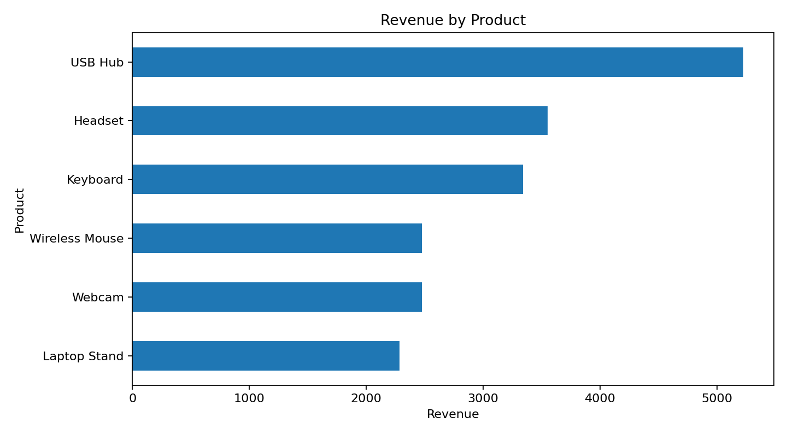
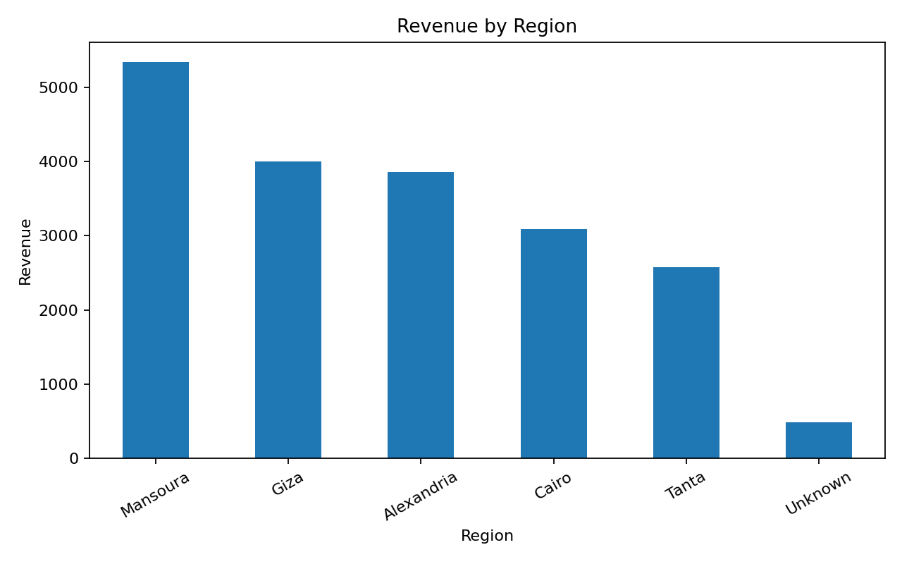
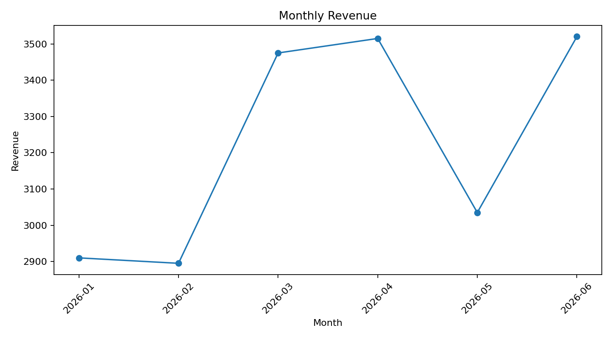

''' Sales Data Analysis

مشروع عملي لتحليل بيانات المبيعات باستخدام Python، يهدف إلى تحويل البيانات الخام إلى معلومات واضحة تساعد على فهم أداء المبيعات واستخراج مؤشرات مفيدة لاتخاذ القرارات.

فكرة المشروع :

يتناول المشروع مجموعة من بيانات المبيعات، بدايةً من تجهيز البيانات وتنظيفها ومعالجة القيم المفقودة، وصولًا إلى تحليل الإيرادات والأرباح واستخراج أهم مؤشرات الأداء

كما يتم تحليل أداء المنتجات والمناطق ومتابعة اتجاه المبيعات على مدار الأشهر، مع استخدام الرسوم البيانية لتسهيل فهم النتائج.

التقنيات المستخدمة :
Python
Pandas
NumPy
Matplotlib
Jupyter Notebook
CSV Data Processing
Data Cleaning
Data Analysis

 خطوات العمل :

1. إنشاء وتجهيز بيانات المبيعات.
2. فحص البيانات واكتشاف القيم المفقودة.
3. تنظيف البيانات ومعالجة القيم المفقودة.
4. حساب الإيرادات والتكاليف والأرباح.
5. استخراج مؤشرات الأداء الرئيسية (KPIs).
6. تحليل الإيرادات حسب المنتجات.
7. تحليل الإيرادات حسب المناطق.
8. تحليل اتجاه المبيعات شهريًا.
9. إنشاء الرسوم البيانية.
10. استخراج أهم النتائج والاستنتاجات.

التحليلات :

Revenue by Product:

يوضح توزيع الإيرادات بين المنتجات المختلفة، مما يساعد على تحديد المنتجات الأكثر مساهمة في إجمالي المبيعات

Revenue by Region

يوضح أداء المبيعات في المناطق المختلفة ومقارنة الإيرادات بينها

Monthly Revenue

يوضح التغير في الإيرادات على مدار الأشهر ويساعد على ملاحظة اتجاهات المبيعات

Key Performance Indicators

يتم حساب مجموعة من المؤشرات الرئيسية، منها:

 إجمالي الإيرادات
 إجمالي التكاليف
 إجمالي الأرباح
 عدد الطلبات
 متوسط قيمة الطلب
 هامش الربح

Business Insights

يساعد التحليل على:

 تحديد المنتجات الأعلى تحقيقًا للإيرادات.
 معرفة المناطق ذات الأداء الأفضل.
 متابعة تغير المبيعات بمرور الوقت.
 فهم العلاقة بين الإيرادات والتكاليف والأرباح.
 تحويل البيانات الخام إلى مؤشرات سهلة الفهم.

 تشغيل المشروع

يمكن تشغيل المشروع باستخدام Jupyter Notebook أو Google Colab.

bash'''
pip install pandas numpy matplotlib
